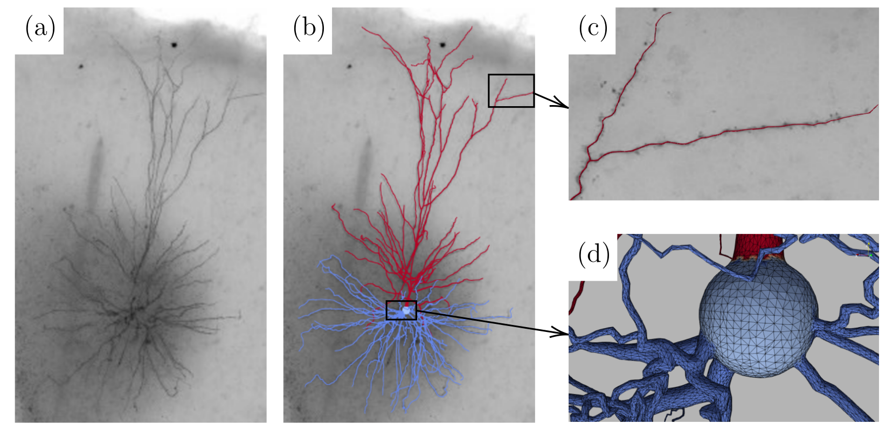
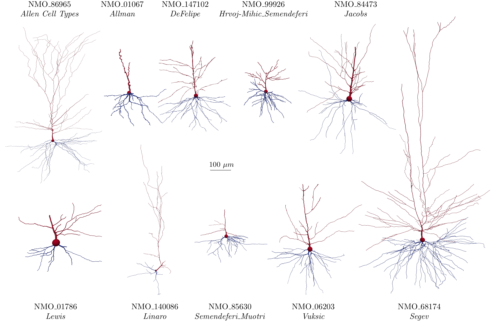

# NeuronSet

A large simulation-ready neuron mesh dataset.

## Description

This dataset was built by converting the digitally reconstructed neurons and glia archived in [NeuroMorpho.Org](https://neuromorpho.org/) to simulation-ready cellular meshes. The conversion is performed with an automatic and robust neuron mesh generator, [swc2mesh](https://github.com/fachra/swc2mesh).

The figure below presents the overlapping of a neuron mesh with its original microscopic image. The neuron's microscopic image is provided by the [Allen Brain Atlas: Cell Types](http://celltypes.brain-map.org/mouse/experiment/morphology/545612828?function%20search()%20{%20[native%20code]%20}). Subfigures (b), (c), and (d) show the neuron surface mesh.

## Download

You can download the neuron meshes, metadata, and neuroanatomical measurements [here](https://www.dropbox.com/sh/sj42ubtrofr6e8g/AADYynnevkRRlnV2AfZYsxtja?dl=0).

## Gallery

## Citation

If you use any mesh in NeuronSet, please cite [NeuroMorpho.Org](https://neuromorpho.org/) and the citations included in each archive.

If NeuronSet is helpful for your research, please also consider cite [swc2mesh](https://github.com/fachra/swc2mesh). See [CITATION.bib](CITATION.bib).
